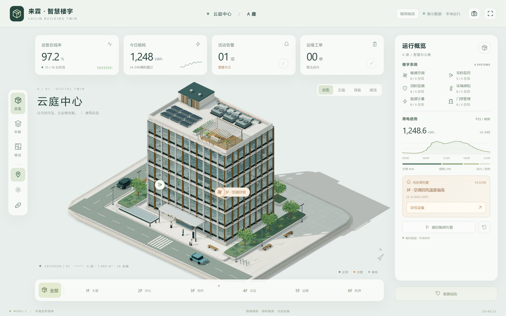

# 来霖 · 智慧楼宇 | LAILIN Building Twin

云庭中心 · 基于纯原生 WebGL 的零依赖自包含 3D 数字孪生楼宇系统。

## 作品定位与系统概览

- **商业级楼宇数字孪生（BMS / IBMS）**：以 6 层现代综合办公楼「云庭中心」（总建筑面积 1,980 m²，纳管 36 台核心设备）为空间载体，呈现高拟真、工业级的数字孪生运维看板。
- **6 大智能化楼宇系统深度覆盖**：
  - 暖通空调（HVAC · 新风与回风温度监控）
  - 消防监测（烟感告警与喷淋状态）
  - 能源计量（强电负荷与能耗动态分析）
  - 安防监控（室外周界与球机布防）
  - 环境感知（温湿度与微气候传感器）
  - 门禁管理（闸机进出与人员流向）
- **多维度三维空间交互**：支持全局总览视角、楼层剖切拆解（Exploded View）、单层独立聚焦透视，以及基于真实三维坐标的设备拾取与工单联动。
- **极端轻量与零依赖交付**：单个自包含 HTML 文件仅 **137 KB**，无需安装任何 npm 依赖，无需搭建本地服务器，双击即跑。

## 底层自研：纯原生 WebGL 架构与数学库 (`Twin`)

本项目完全放弃使用 Three.js、Babylon.js 等通用重型引擎，所有图形与数学管线均基于 **WebGL 2 原生上下文**纯手写构建：

### 1. 手写 3D 线性代数与投影几何 (`Twin.math`)
- **列优先 4x4 变换矩阵（Matrix4）**：手写完整的模型矩阵（Model）、视图矩阵（View）与透视投影矩阵（Projection），精确处理空间平移、旋转与仿射缩放。
- **相机动力学与空间换算**：实现平滑阻尼轨道相机（Orbit Controls），支持欧拉角转换与视锥矩阵实时重算；提供精确的屏幕像素坐标到三维世界坐标的反投影射线算法。

### 2. 参数化程序化建筑建模 (`Twin.buildModel` / `Twin.geometry`)
- **零外部 3D 模型下载**：无 `.gltf`、`.obj` 等外部资产请求。整栋大厦以真实米制（Metres）单位，由代码程序化生成 6 套独立楼层总成、承重柱网、双层中空玻璃幕墙、核心筒与屋顶光伏构架。
- **轻量 VBO 顶点流管线**：在浏览器内存中直接生成交错顶点缓冲区（Interleaved VBO），将位置坐标、法向量与表面材质编码为紧凑 TypedArray，单次 DrawCall 高效提交 GPU。

### 3. 原生 GLSL 着色器与光影表现 (`Twin.Renderer`)
- **双通道着色器管线**：手写紧凑的顶点与片元 Shader，支持半球环境光（Hemisphere Light）与方向主光源漫反射，精准模拟建筑剖面的明暗层次。
- **菲涅尔半透明幕墙渲染**：片元着色器中结合视线向量与面法线点积，实现基于菲涅尔定律（Fresnel Effect）的通透玻璃幕墙与反射效果。

## 业务状态机与交互解耦 (`Twin.Store`)

- **渲染与业务严格隔离**：设备运行工况、24 小时模拟负荷时序、告警派单状态均维护在独立的响应式 Store 中，三维视图仅作为状态投影器。
- **空间设备自发光标记点**：三维场景中的设备状态标签实时同步世界坐标投影，实现 3D 锚点与 2D UI 弹窗的无缝贴合。

## 工程能力迁移与应用场景

本项目所展示的纯手写原生 WebGL 与轻量化数字孪生技术可无缝迁移至以下工业级场景：
- **智慧楼宇 / 智慧园区综合管理平台（IBMS）**：大型商业综合体、医院或数据中心的建筑剖面监控、设备拓扑定位与告警联动大屏。
- **涉密物理隔离内网的 3D 可视化**：针对严格断网、禁止外链 CDN、低硬件配置的工控机或终端，提供 137KB 零依赖、开箱即用的纯前端 3D 数字底座。
- **工业产线与物流仓储数字孪生**：产线设备空间点位标定、AGV 路径动态映射与能耗时序监测。

## 快速运行与操作指南

1. **直接运行**：使用桌面端 Chrome、Edge 或其他支持 WebGL 2 的现代浏览器，直接双击打开 `index.html`。
2. **交互操作**：
   - **三维视角**：按住鼠标左键拖拽旋转建筑，滚动滚轮缩放视角；右上角提供「总览」、「正面」、「背面」、「屋顶」预设视角快捷切换；
   - **楼层拆解与聚焦**：点击左侧「拆解」可观察各层立体炸开形态；底部导航栏支持 1F~6F 逐层独立巡检；
   - **设备与告警联动**：点击画面中的 3D 浮动设备标签或右侧告警卡片，视角自动对焦并展开详细工况。

## 版权

作品代码与原创内容保留全部权利。
