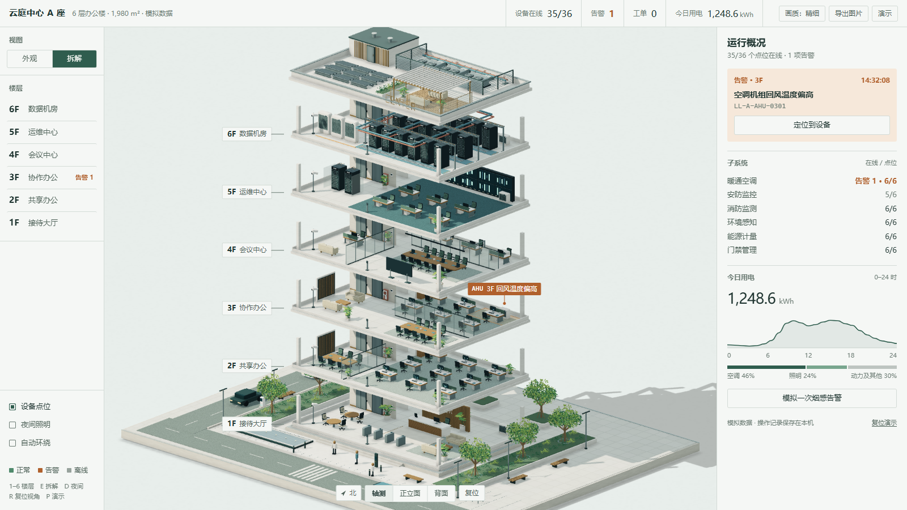
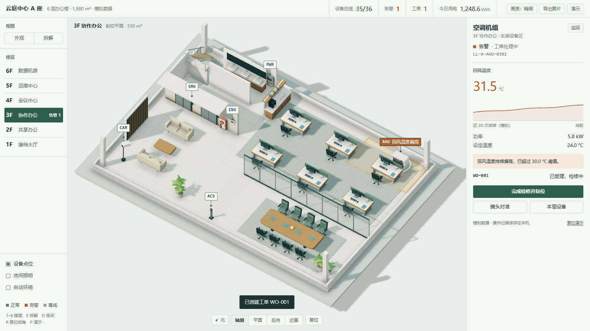

# Building Twin · 楼宇三维交互原型

一个自包含的原生 WebGL 2 楼宇展示，用模拟数据演示楼层拆解、单层查看与设备定位。这是前端交互原型，尚未接入真实楼宇自控系统。

[在线模拟展示](https://building-twin-five.vercel.app/)

## 可以查看什么

- 六层虚拟办公楼，36 个模拟空间点位。
- 楼层展开、单层聚焦、鼠标旋转和缩放。
- 三维点位与设备卡片联动，日夜显示和告警定位。
- 立面有石材转角柱、南向水平遮阳板、通透首层大堂；屋面有冷机百叶围挡、女儿墙金属压顶、光伏板和屋顶花园。
- 建筑、设备、家具全部由代码参数化生成，无外部模型、字体、CDN 或 npm 依赖。

| 楼层拆解 | 单层查看 |
|---|---|
|  |  |

## 运行

用支持 WebGL 2 的现代浏览器打开 `index.html`（双击本地打开也可以）。左键拖动旋转，滚轮缩放；左侧选楼层，右侧看设备与工单。

| 文件 | 内容 |
|---|---|
| `index.html` | 页面结构 |
| `css/app.css` | 界面样式，日间 / 夜间两套配色 |
| `js/math.js` | 列主序矩阵、投影、拾取用的数学函数 |
| `js/renderer.js` | WebGL 2 渲染：实例化绘制、阴影贴图、接触阴影、玻璃菲涅尔 |
| `js/model.js` | 建筑、场地、家具与设备的参数化建模，单位为米 |
| `js/data.js` | 模拟设备、遥测与工单存储 |
| `js/app.js` | 界面、相机与交互 |

开发时也可运行 `python -m http.server 8080`，访问本机 8080 端口。

## 能力边界

这是纯前端模拟数据，没有真实 PLC/BACnet/Modbus 接入、后端历史库、设备回执或生产权限管理。用途是验证三维空间交互与前端嵌入方式。涉密环境适用性、目标工控机帧率、真实手机和长时间运行，需要单独评估和验收。

需要监测服务与数据接入的参考工程可查看 [park-studio](https://github.com/yinren112/park-studio)。

## 授权

当前仓库未附独立 LICENSE 文件。复用或商用前请联系作者确认授权，不将仓库公开视为 MIT 授权。
